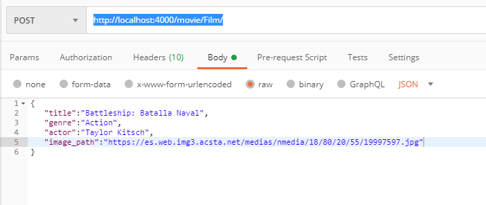
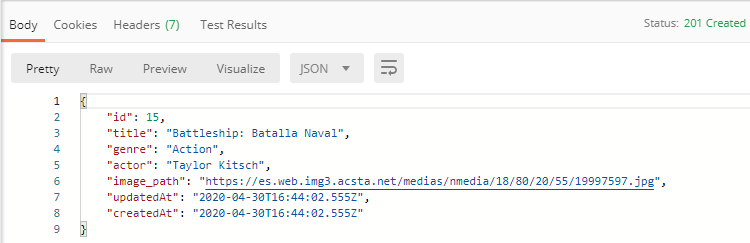

# GH-Proyecto1-Netflix-Backend

ClassicNetflixBackend

_Este es mi backend del proyecto ClassicNetflix, acontinuacion hare unas breves explicaciones de como funciona, los resquisitos, las tecnologias que hemos utilizamo y demas, espero que os guste, graciass._

## Pre-requisitos 📋

_¿Que cosas necesitas para instalar el software y como instalarlas?_

Necesitaremos una herramienta donde podremos trabajar , en el cual yo he utilizado Visual Studio Code, tambien necesitaremos Xamp , para tener nuestra base de datos con Mysql y Postman para hacer las pruebas. El proyecto es compatible para todas los sistemas operativos, y para todas las plataformas de internet.

## Instalación 🔧

  

_Empezamos con la instalación_

_El primer paso al descargar el repositorio, tenemos que hacer el comando de abajo para poder descargar todos los modulos que gemos utilizado y asi pode hacer funcionar el proyecto_

  

```
npm i
```

  

_Y para arrancar el servidor, lo haremos con el siguiente comando_

```
node index.js
```
_Y ahora ya podremos hacer nuestras pruebas_

  

## Ejecutando las pruebas ⚙️
 _Para poder hacer las prueba debes estar encendido el xamp, por lo tanto el Mysql en los puertos correspondientes y obviamente el Postman._

### La primera prueba que vamos a hacer va ser registrarse en la pagina web⌨️

_En esta foto podemos ver como nos podemos registrar.
Para acceder a este endpoint , tenemos que escribir en el buscador de postman la siguiente url: http://localhost:4000/users/register/ y tiene que estar en POST._


_Y aqui podemos ver como se ha registrado el usuario y con su contraseña encriptada._
### Ahora vamos a loguearnos, despues de habernos registrado ya⌨️

_En esta foto podemos ver como nos podemos loguear.
Para acceder a este endpoint , tenemos que escribir en el buscador de postman la siguiente url: http://localhost:4000/users/login/ y tiene que estar en POST._


_Y aqui podemos ver al usuario logueado y con su token._


### Ahora vamos a hacer la prueba de  crear una película ⌨️

_En esta foto podemos ver como crea la película.
Para acceder a este endpoint , tenemos que escribir en el buscador de postman la siguiente url: http://localhost:4000/movie/Film/ y tiene que estar en POST._


_Y aqui podemos ver como se creó la pelicula._
### Y en esta prueba vamos a ver como nos muestra todas las peliculas que hemos creado ⌨️
_Para acceder a este endpoint , tenemos que escribir en el buscador de postman la siguiente url: http://localhost:4000/movie/Movies/ y tiene que estar en GET._


_Y nos muestra las peliculas que hemos creado_

### En esta prueba que vamos a hacer, vamos a mostrar como filtrar la pelicula por Id⌨️
_Primer filtro: Buscar por ID, tenemos que escribir en el buscador de postman la siguiente url: http://localhost:4000/movie/Movies/1(ponemos cualquier id de las peliculas que tenemos creadas) y tiene que estar en GET._


_Y nos muestra la pelicula segun su Id_

### En esta prueba, vamos a mostrar como filtrar la pelicula por genero⌨️
_Segundo filtro: Buscar por genero, tenemos que escribir en el buscador de postman la siguiente url: http://localhost:4000/movie/Genre/?genre=action(ponemos cualquier genero de las peliculas que tenemos creadas) y tiene que estar en GET._


_Y nos muestra las peliculas segun sus generos_

### Con la prueba que hemos hecho del filtro de genero, hacemos los mismo tanto si queremos filtrar por titulo y por actor, lo unico que cambia es la url, que son las siguientes:
* Filtro por actor: http://localhost:4000/movie/Actors/?actor=Arnold Schwarzenegger (ponemos los actores que este en nuestra base de datos)
* Filtro por actor: http://localhost:4000/movie/Title/?title=Arnold Dolor y Gloria (ponemos los titulos que este en nuestra base de datos)


### Ahora vamos a hacer la prueba de los pedidos ⌨️

_En esta foto podemos ver como hacemos un pedido.
Para acceder a este endpoint , tenemos que escribir en el buscador de postman la siguiente url: http://localhost:4000/Pedidos/Pedido/ y tiene que estar en POST._


_Y aqui podemos ver como se creó el pedido._

### Ahora vamos a ver el pedido que hemos realizado ⌨️

_En esta foto podemos ver como hacemos un pedido, vemos la pelicula que hemos alquilado y que usuario la ha alquilado
Para acceder a este endpoint , tenemos que escribir en el buscador de postman la siguiente url: http://localhost:4000/Pedidos/Compras/ y tiene que estar en GET._


## Construido con 🛠️

_En este proyecto hemos utilizado las siguientes tecnologias :_

  

*  NODE

*  EXPRESS

* MYSQL (sequelize Cli)

  

## Autores ✒️

  

_Menciono a mis compañeros en cual estamos en el proyecto_

  

*  **Boggy** - *Fronted* - (https://github.com/mrboggii)

*  **Sebastian** - *Una parte del Backend* -(https://github.com/Sebastian)
*  **Antony** - *Otra parte del Backend* -(https://github.com/Sebastian)

  

También puedes mirar la lista de todos los [contribuyentes](https://github.com/your/project/contributors) quíenes han participado en este proyecto.

  
  


---

⌨️ con ❤️ por [Antony](https://github.com/)